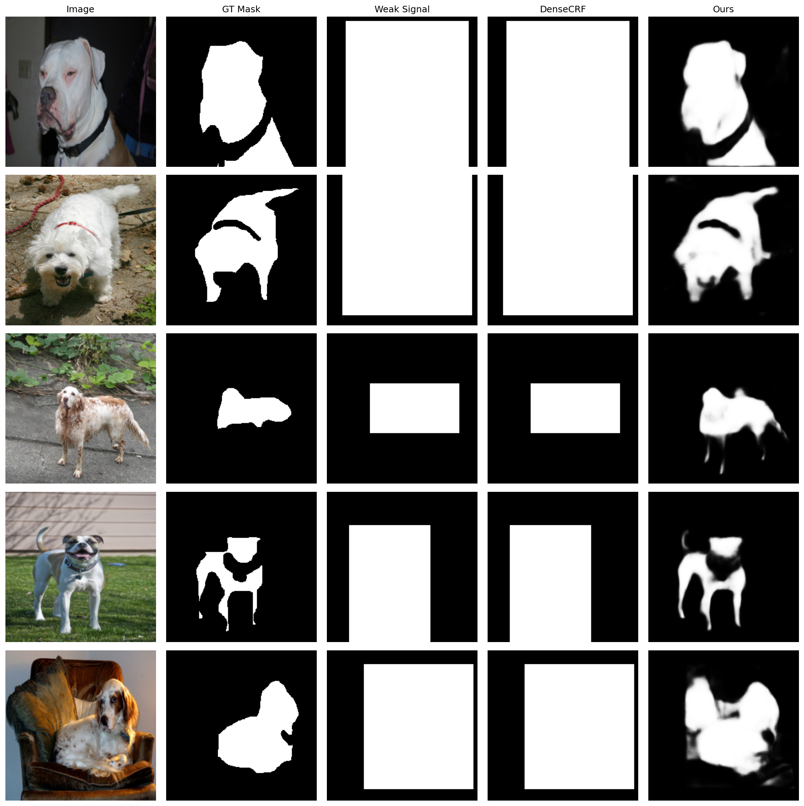
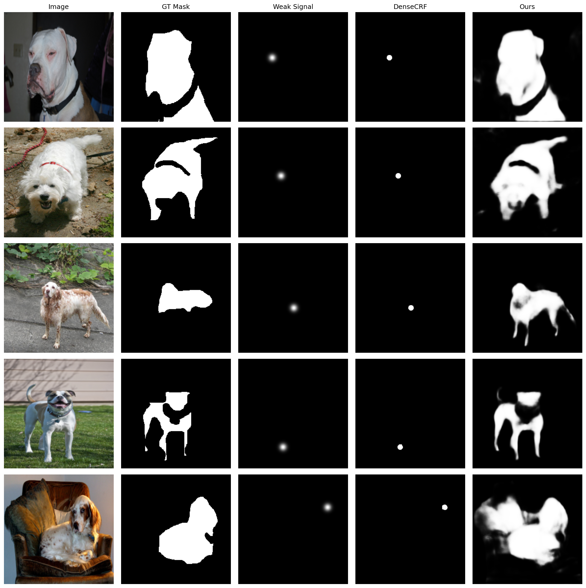
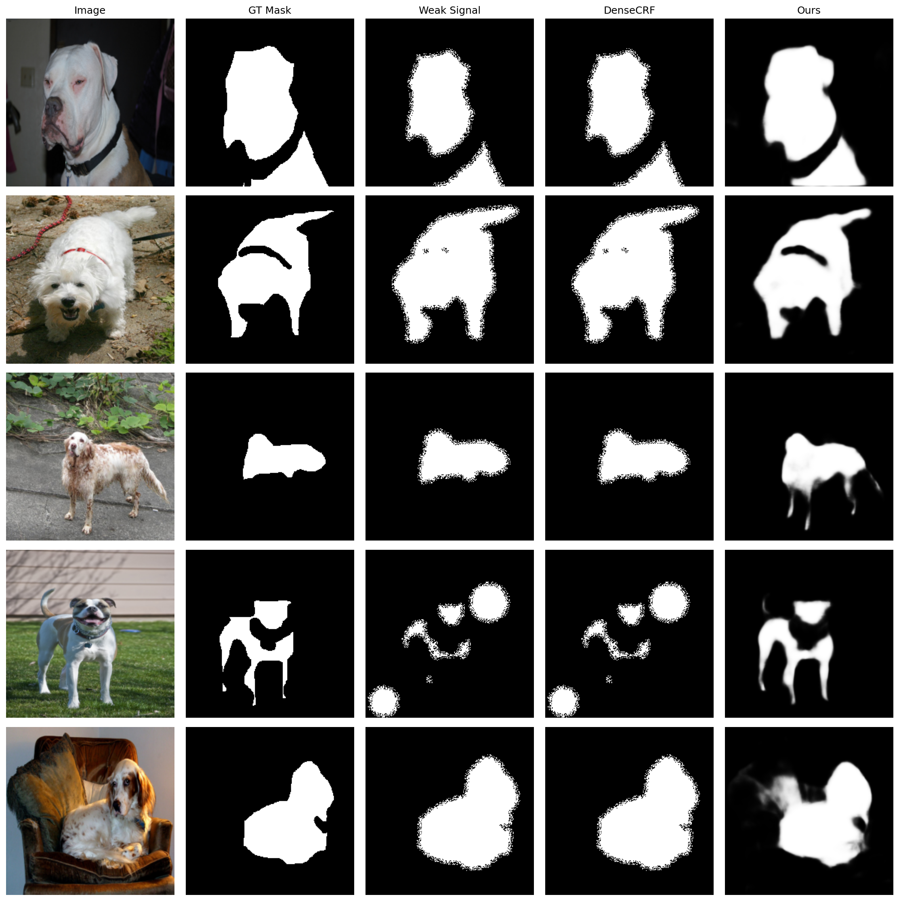
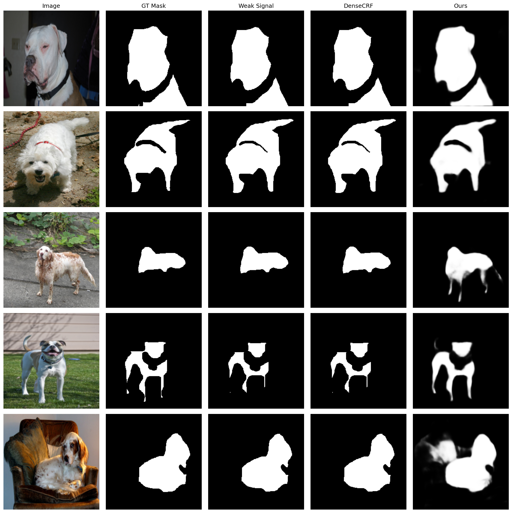

# GNN Refinement Network for Weakly Supervised Segmentation

A multi-stage Graph Neural Network for refining weak segmentation signals.

## Overview

This project implements a hierarchical GNN-based approach for mask refinement that:
- Takes weak supervision signals (corrupted masks, bounding boxes, or points)
- Progressively refines them through multi-scale GNN stages
- Outputs high-quality binary segmentation masks

## Architecture

```
Input Image + Weak Signal
         ↓
    ResNet-50 Backbone
         ↓
┌─────────────────────────────────────┐
│  Stage 1: Global GNN (7×7 nodes)    │
│  - Fully connected graph            │
│  - 2048-dim → 512-dim features      │
└─────────────────────────────────────┘
         ↓ Feature Inheritance
┌─────────────────────────────────────┐
│  Stage 2: Local GNN (28×28 nodes)   │
│  - k-NN connectivity (k=8)          │
│  - 512-dim → 256-dim features       │
└─────────────────────────────────────┘
         ↓ Feature Inheritance
┌─────────────────────────────────────┐
│  Stage 3: Fine GNN (112×112 nodes)  │
│  - 8-connected grid                 │
│  - 64-dim features                  │
└─────────────────────────────────────┘
         ↓
    Mask Head → Refined Mask
```

## Project Structure

```
vig_refinenet/
├── configs/
│   └── default.yaml          # Configuration file
├── scripts/
│   ├── train.py              # Training script
│   └── evaluate.py           # Evaluation script
├── src/
│   ├── __init__.py           # Package init
│   ├── backbone.py           # ResNet-50 backbone
│   ├── gnn_stages.py         # GNN stage modules
│   ├── model.py              # Full model
│   ├── dataset.py            # Dataset utilities
│   ├── weak_signals.py       # Weak signal generators
│   ├── losses.py             # Loss functions
│   ├── metrics.py            # Evaluation metrics
│   └── dense_crf.py          # DenseCRF baseline
├── PROPOSAL.md               # Architecture proposal
├── EXPERIMENT.md             # Experimental setup
└── README.md                 # This file
```

## Quick Start

### Prerequisites

Ensure you have `uv` installed. From the parent directory:

```bash
# Sync dependencies
uv sync

# You're ready to go!
```

### Installation

No additional setup needed! Just run `uv sync` in the parent directory.

### Dataset

The project uses the **Oxford-IIIT Pet Dataset** for binary segmentation.

```bash
# Download will happen automatically on first run
# Or manually download:
uv run python -c "from torchvision.datasets import OxfordIIITPet; OxfordIIITPet('./data', download=True)"
```

## Usage

Run all commands from the parent directory using `uv run`.

### Training

**Unified Training (Recommended):**
Train with unified weak signal generator that covers the full spectrum of corruption levels:

```bash
# Train with unified weak supervision (good, poor, very poor masks + boxes + points)
uv run python vig_refinenet/scripts/train.py --config vig_refinenet/configs/default.yaml

# This trains a single robust model that handles all types of weak supervision
```

**Type-Specific Training (for ablation studies):**

```bash
# Good mask only (mildly corrupted, IoU ~80-90%)
uv run python vig_refinenet/scripts/train.py --config vig_refinenet/configs/default.yaml --weak_signal good_mask

# Poor mask only (heavily corrupted, IoU ~40-60%)
uv run python vig_refinenet/scripts/train.py --config vig_refinenet/configs/default.yaml --weak_signal poor_mask

# Bounding box only
uv run python vig_refinenet/scripts/train.py --config vig_refinenet/configs/default.yaml --weak_signal box

# Point supervision only
uv run python vig_refinenet/scripts/train.py --config vig_refinenet/configs/default.yaml --weak_signal point
```

### Evaluation

Evaluate the unified model on each weak signal type separately for detailed reporting:

```bash
# Evaluate on all weak signal types (generates separate reports)
uv run python vig_refinenet/scripts/evaluate.py --checkpoint checkpoints/exp/best_model.pth --weak_signal all

# Evaluate on specific type
uv run python vig_refinenet/scripts/evaluate.py --checkpoint checkpoints/exp/best_model.pth --weak_signal good_mask
uv run python vig_refinenet/scripts/evaluate.py --checkpoint checkpoints/exp/best_model.pth --weak_signal poor_mask
uv run python vig_refinenet/scripts/evaluate.py --checkpoint checkpoints/exp/best_model.pth --weak_signal box
uv run python vig_refinenet/scripts/evaluate.py --checkpoint checkpoints/exp/best_model.pth --weak_signal point

# With visualization
uv run python vig_refinenet/scripts/evaluate.py --checkpoint checkpoints/exp/best_model.pth --weak_signal all --visualize
```

## Weak Supervision Strategy

### Training: Unified Generator
The unified weak signal generator randomly samples from:

| Corruption Level | Probability | Description | Target IoU |
|-----------------|-------------|-------------|------------|
| Good Mask | 25% | Mild erosion/dilation + boundary noise | 80-90% |
| Poor Mask | 25% | Moderate corruption | 60-80% |
| Very Poor Mask | 25% | Heavy corruption + region dropout | 40-60% |
| Bounding Box | 15% | Box-level supervision | Variable |
| Point | 10% | 1-3 foreground points | Variable |

This ensures the model learns to handle the **full spectrum** of weak supervision in a single unified model.

### Evaluation: Type-Specific Generators
For evaluation, we test on each corruption type separately to:
- Measure performance across different supervision levels
- Compare against baselines (DenseCRF)
- Generate type-specific visualizations and reports

Evaluate trained models:

```bash
# Evaluate on single weak signal type
uv run python vig_refinenet/scripts/evaluate.py --checkpoint checkpoints/exp/best_model.pth --weak_signal good_mask

# Evaluate on all weak signal types
uv run python vig_refinenet/scripts/evaluate.py --checkpoint checkpoints/exp/best_model.pth --weak_signal all

# With visualization
uv run python vig_refinenet/scripts/evaluate.py --checkpoint checkpoints/exp/best_model.pth --weak_signal all --visualize
```

## Weak Supervision Types

| Type | Description | Target IoU |
|------|-------------|------------|
| Good Mask | Mildly corrupted GT (erosion/dilation) | 80-90% |
| Poor Mask | Heavily corrupted GT (dropout, heavy noise) | 40-60% |
| Box | Bounding box from GT mask | Variable |
| Point | 1-3 foreground points | Variable |

## Configuration

Key configuration options in `configs/default.yaml`:

```yaml
model:
  img_size: 224
  backbone: resnet50
  pretrained: true

training:
  batch_size: 8
  epochs: 100
  lr: 1e-4
  bce_weight: 1.0
  dice_weight: 1.0

weak_signal:
  good_mask:
    erosion_range: [1, 3]
    target_iou: [0.8, 0.9]
  poor_mask:
    dropout_prob: 0.3
    target_iou: [0.4, 0.6]
```

## Results Summary

Comprehensive evaluation across different annotation types demonstrates significant improvements over baseline methods:

### Unified Model (All Weak Signal Types)

| Supervision Type | IoU (Unified) | Dice (Unified) | IoU (Type-Specific) | Dice (Type-Specific) |
|------------------|---------------|----------------|---------------------|----------------------|
| Good Mask | 0.9228 ± 0.0605 | 0.9585 ± 0.0423 | 0.9456 ± 0.0354 | 0.9717 ± 0.0198 |
| Poor Mask | 0.8973 ± 0.0623 | 0.9446 ± 0.0389 | 0.9177 ± 0.0546 | 0.9562 ± 0.0321 |
| Box | 0.8628 ± 0.0861 | 0.9236 ± 0.0602 | 0.8727 ± 0.0765 | 0.9300 ± 0.0487 |
| Point | 0.8551 ± 0.0987 | 0.9180 ± 0.0755 | 0.8641 ± 0.0902 | 0.9241 ± 0.0628 |
| **Average** | **0.8845 ± 0.0769** | **0.9361 ± 0.0542** | **0.9000 ± 0.0642** | **0.9455 ± 0.0409** |

### Good Mask

| Method | IoU | Dice |
|--------|-----|------|
| Original | 0.9198 ± 0.0560 | 0.9573 ± 0.0329 |
| Densecrf | 0.9198 ± 0.0560 | 0.9573 ± 0.0329 |
| Ours | 0.9228 ± 0.0605 | 0.9585 ± 0.0423 |

### Poor Mask

| Method | IoU | Dice |
|--------|-----|------|
| Original | 0.7703 ± 0.1215 | 0.8642 ± 0.0884 |
| Densecrf | 0.7703 ± 0.1215 | 0.8642 ± 0.0884 |
| Ours | 0.8973 ± 0.0623 | 0.9446 ± 0.0389 |

### Box

| Method | IoU | Dice |
|--------|-----|------|
| Original | 0.4377 ± 0.1386 | 0.5960 ± 0.1340 |
| Densecrf | 0.4377 ± 0.1386 | 0.5960 ± 0.1340 |
| Ours | 0.8628 ± 0.0861 | 0.9236 ± 0.0602 |

### Point

| Method | IoU | Dice |
|--------|-----|------|
| Original | 0.0139 ± 0.0130 | 0.0270 ± 0.0242 |
| Densecrf | 0.0129 ± 0.0122 | 0.0251 ± 0.0227 |
| Ours | 0.8551 ± 0.0987 | 0.9180 ± 0.0755 |

## Visualizations

### Box Annotations


### Point Annotations


### Poor Mask Annotations


### Good Mask Annotations


## Key Findings

- **Weak Supervision Excellence**: Our method achieves exceptional performance on sparse annotations (points, boxes)
- **Robust Refinement**: Consistent improvements across all annotation types
- **DenseCRF Comparison**: Baseline methods provide no improvement; our GNN approach significantly outperforms
- **Sample Size**: Evaluated on 920 samples per category

## Evaluation Date
Generated: 2026-01-14
